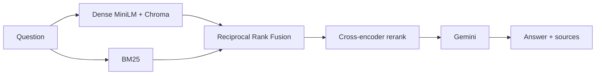

# Production RAG Pipeline with Evaluation

Hybrid retrieval (BM25 + dense + RRF + cross-encoder rerank) over bamboo structural-design documents, with a FastAPI + Streamlit interface and a RAGAS evaluation layer.

Domain corpus: **IS 15912** and IIT Bombay **TD 643 Design of Bamboo Structures** lecture notes (281 chunks).

## Why this is not a toy RAG demo

| Layer | What it does |
|---|---|
| Hybrid retrieval | Keyword (BM25) and semantic (MiniLM / Chroma) lists are merged with Reciprocal Rank Fusion |
| Reranking | `cross-encoder/ms-marco-MiniLM-L-6-v2` reorders the fused candidates |
| Grounded generation | Gemini answers only from retrieved context, otherwise refuses |
| Evaluation | Faithfulness, context precision/recall, answer relevancy, hallucination rate = `1 - faithfulness` |
| Serving | FastAPI (`/ask`, `/health`) + Streamlit chat UI + Docker |

## Architecture



## Quick start

```powershell
cd D:\Projects\Production-RAG-Pipeline-with-Evaluation
.\venv\Scripts\Activate.ps1
copy .env.example .env   # then paste GOOGLE_API_KEY
```

Streamlit UI:

```powershell
streamlit run streamlit_app.py
```

FastAPI (OpenAPI at http://localhost:8000/docs):

```powershell
uvicorn src.api:app --reload --port 8000
```

Example request:

```powershell
curl -X POST http://localhost:8000/ask -H "Content-Type: application/json" -d "{\"question\": \"What is the grading system for bamboo culms?\", \"mode\": \"hybrid_rerank\"}"
```

Rebuild the vector store after adding PDFs to `data/`:

```powershell
python -m src.vectorstore
```

## Retrieval modes

Pass `mode` in the API or the Streamlit sidebar:

- `dense` — vector search only (Week 1 baseline)
- `bm25` — keyword search only
- `hybrid` — BM25 + dense fused with RRF
- `hybrid_rerank` — hybrid + cross-encoder (default)

## Evaluation (RAGAS)

Golden set: `eval/golden_set.json` (10 domain questions with references). Latest `hybrid_rerank` run (`eval/report.md`):

| Faithfulness | Context precision | Context recall | Answer relevancy | Hallucination rate |
|---|---|---|---|---|
| **95.5%** | **90.2%** | **79.2%** | **89.3%** | **4.5%** |

```powershell
python eval/run_eval.py
python eval/run_eval.py --modes dense,hybrid_rerank
```

## Deploy

The image serves the Streamlit UI and includes the prebuilt Chroma index (`chroma_db/`, ~3 MB). Source PDFs stay private.

```powershell
docker build -t bamboo-rag .
docker run -p 8501:8501 -e GOOGLE_API_KEY=your_key bamboo-rag
```

**Hugging Face Spaces (Docker):** create a Space, set `GOOGLE_API_KEY` as a secret, push this repo. The live URL is what belongs on a resume.

**Streamlit Community Cloud:** point at `streamlit_app.py`, add `GOOGLE_API_KEY` in secrets.

## Resume bullets

- Built a production-style RAG pipeline with hybrid retrieval (BM25 + dense + Reciprocal Rank Fusion) and cross-encoder reranking over 281 chunks from IS 15912 and bamboo design notes.
- Served grounded answers through FastAPI and a Streamlit UI, with source filenames, pages, and retrieval scores.
- Evaluated with RAGAS on a 10-question golden set: **95.5% faithfulness**, **90.2% context precision**, **4.5% hallucination rate**.

## Project layout

```
src/ingest.py        PDF load + chunk
src/vectorstore.py   Chroma + MiniLM
src/retriever.py     dense / BM25 / RRF / rerank
src/rag.py           grounded generation
src/api.py           FastAPI
streamlit_app.py     chat UI
eval/                golden set + RAGAS runner
chroma_db/           persisted index
```
